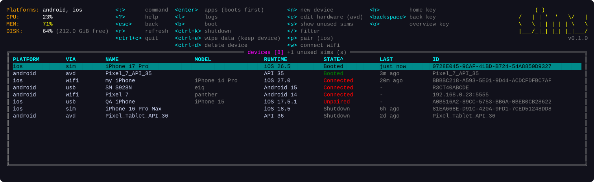
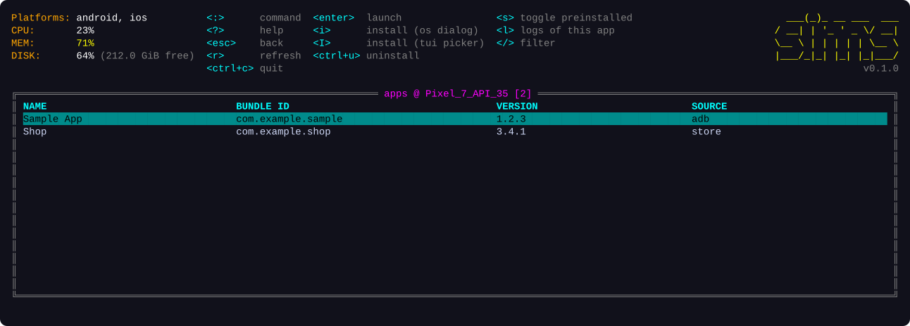
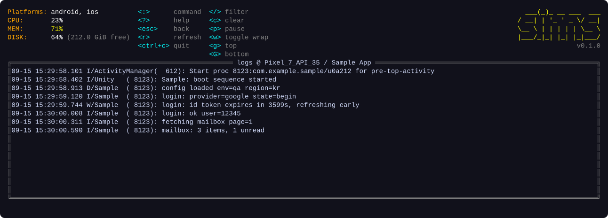
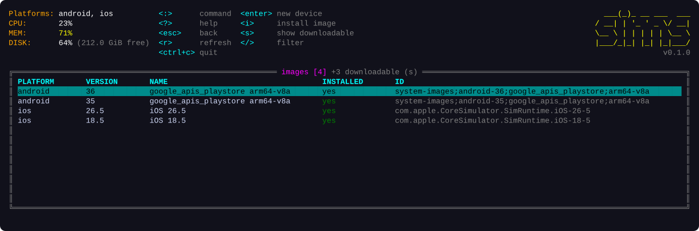
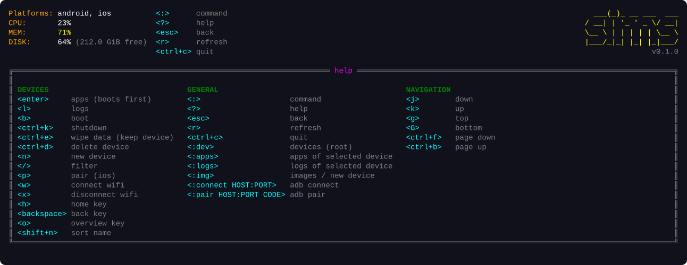

<p align="center">
  
</p>

<h1 align="center">sims</h1>

<p align="center">Android emulators, iOS simulators and real phones, in one k9s-style terminal UI.</p>

<p align="center">
  <a href="https://github.com/siner308/sims/actions/workflows/ci.yml"></a>
  <a href="https://github.com/siner308/sims/releases"></a>
  <a href="go.mod"></a>
  
</p>

**sims** is a terminal UI for the devices a mobile developer keeps around: Android emulators, iOS simulators, and the phones plugged in over USB or sitting on the same wifi. It wraps `adb`, `emulator`, `avdmanager`, `sdkmanager`, `xcrun simctl` and `xcrun devicectl` behind one k9s-style screen, so booting, installing a build, tailing logs or wiping a device is a keystroke instead of a command you have to remember.

<p align="center">
  
</p>

## Why

Android Studio and Xcode both ship a device manager, and both take a while to open when all you want is "boot that emulator and put this APK on it". The command line tools underneath are scattered across two SDKs with different argument styles. sims puts them on one screen with the same keys for both platforms, and adds what the GUI managers leave out: which phones are reachable right now, how they are connected, and when each device was last used.

## Install

No toolchain needed; grab the binary for your machine.

```sh
# macOS / Linux: the latest release into /usr/local/bin (or ~/.local/bin when that is not writable)
curl -fsSL https://raw.githubusercontent.com/siner308/sims/main/install.sh | sh
```

The script asks GitHub for the latest release, so this line never needs updating. Two optional knobs: `SIMS_VERSION=<tag>` installs a specific release and `SIMS_INSTALL_DIR=<dir>` picks the directory.

```sh
SIMS_VERSION=<tag> SIMS_INSTALL_DIR="$HOME/bin" sh -c "$(curl -fsSL https://raw.githubusercontent.com/siner308/sims/main/install.sh)"
```

Windows: download `sims_windows_amd64.zip` (or `arm64`) from the [releases page](https://github.com/siner308/sims/releases), unzip, and put `sims.exe` on your `PATH`.

Every release ships `sims_<os>_<arch>.tar.gz` (`.zip` on Windows) plus `checksums.txt`, which `install.sh` verifies.

With a Go toolchain (the module is public, so this works from any machine, mirrors included):

```sh
go install github.com/siner308/sims/cmd/sims@latest
```

`sims --version` prints the installed version, from the release build or from the module version `go install` fetched.

### What sims needs on the machine

`sims doctor` checks every tool below and prints how to get the missing ones; `install.sh` runs it at the end. Either platform is enough; the header shows what was found.

```
$ sims doctor
sims v0.1.0
android
  ok       Android SDK    /Users/me/Library/Android/sdk
  ok       adb            /Users/me/Library/Android/sdk/platform-tools/adb (36.0.0)
  ok       emulator       /Users/me/Library/Android/sdk/emulator/emulator
  MISSING  avdmanager     install cmdline-tools into <sdk>/cmdline-tools/latest
  MISSING  sdkmanager     install cmdline-tools into <sdk>/cmdline-tools/latest
  skip     aapt2          optional: sdkmanager "build-tools;35.0.0" (app names fall back to package ids without it)
ios
  ok       xcrun          /usr/bin/xcrun
  ok       Xcode          26.6
  ok       simctl         xcrun simctl
  ok       devicectl      xcrun devicectl
  skip     idevicesyslog  optional: brew install libimobiledevice (needed for logs from physical iPhones)
```

| Platform | Needs | How sims finds it |
|----------|-------|-------------------|
| android | `adb`, `emulator`, `avdmanager`, `sdkmanager`; `aapt2` (build-tools) for app names | `ANDROID_HOME` or `ANDROID_SDK_ROOT`, then the default SDK path (`~/Library/Android/sdk`, `%LOCALAPPDATA%\Android\Sdk`, `~/Android/Sdk`), then `PATH` |
| ios | Xcode command line tools (`xcrun simctl`, `xcrun devicectl`) | macOS only. Physical-device logs also need `idevicesyslog` (`brew install libimobiledevice`) |

## Tour

### Devices

Everything in one table: `VIA` says how a device is reached (`avd` and `sim` are virtual, `usb` and `wifi` are physical), `STATE` is colored, `LAST` is the last boot or last connection. Simulators that have never been booted (a fresh Xcode lists dozens) stay hidden until you press `s`; the title shows how many. Running devices sort first, then the most recently used. `shift+letter` sorts by a column; the same key again flips the direction.

`enter` opens the apps of the selected device. On a stopped virtual device it asks to boot it first and opens apps once it is up.

### Apps

<p align="center">
  
</p>

Apps you installed come first with their display name and version; preinstalled apps are hidden until you press `s`. `SOURCE` tells `adb` sideloads from `store` installs. `i` opens the OS file dialog (Finder, Explorer) to pick an `.apk` or `.app`; `I` opens the built-in file picker instead.

### Logs

<p align="center">
  
</p>

Live `logcat` or `log stream` with a substring filter, pause, clear, and a wrap toggle for long lines. From the apps view, `l` narrows the stream to the selected app (`logcat --pid` on Android, `log stream --predicate` on iOS). Works for simulators and for physical devices (`idevicesyslog` on iOS).

### Images and new devices

<p align="center">
  
</p>

Installed system images and iOS runtimes by default; `s` adds everything `sdkmanager` can still download. `enter` on an installed image opens a form and creates the AVD or simulator: name, device profile with its screen size where the SDK knows it (`pixel_7  1080x2400`, `iPhone 17 Pro  1206x2622 @3x`), and for Android also RAM, CPU cores and disk. Those three can be changed later from the devices view with `e`. Android images install from here with `i`; iOS runtimes come from `xcodebuild -downloadPlatform iOS`.

### Help

<p align="center">
  
</p>

`?` lists every key for the current view, plus commands and navigation.

## Keys

| Scope | Key | Action |
|-------|-----|--------|
| global | `:` | command bar (`:dev` `:apps` `:logs` `:img` `:connect HOST:PORT` `:pair HOST:PORT CODE`) |
| global | `?` / `esc` / `ctrl+c` | help / back / quit |
| global | `r` | refresh |
| devices | `b` | boot |
| devices | `ctrl+k` `ctrl+e` `ctrl+d` | shutdown; wipe data (factory reset, the device stays); delete the device itself. On a physical device `ctrl+d` forgets it instead: iOS unpairs (`devicectl manage unpair`), Android drops the wifi connection (`adb disconnect`); a USB phone simply leaves when unplugged |
| devices | `a` or `enter` / `l` | apps / log stream of the selected device. On a stopped virtual device `enter` asks to boot it first and opens apps once it is up |
| devices | `n` / `e` / `s` / `/` | new device (opens images) / edit hardware of an AVD (RAM, cores, disk; applied at its next boot) / show never-booted simulators / filter |
| devices | `w` / `x` | android: switch a USB device to adb over wifi / disconnect a wifi device. ios: open the wifi tunnel to a paired phone (`devicectl device info details`) |
| devices | `p` | ios: pair a physical device (`devicectl manage pair`) |
| devices, apps | `h` / `backspace` / `o` | send Home / Back / Overview to the device (android: `adb shell input keyevent`) |
| devices | `shift+P` `V` `N` `M` `R` `S` `L` | sort by platform, via, name, model, runtime, state, last; same key again flips direction. Default: state (running, offline, shutdown), then most recent; ties by name desc, runtime desc |
| apps | `enter` / `i` / `I` / `ctrl+u` | launch / install via the OS file dialog (Finder on macOS, Explorer on Windows; falls back to the TUI picker elsewhere) / install via the TUI picker / uninstall |
| apps | `l` | logs of the selected app only (android: `logcat --pid`, so the app must be running; ios: `log stream --predicate`) |
| apps | `s` / `/` | toggle preinstalled apps (hidden by default) / filter |
| picker | `enter` `backspace` `~` `d` `.` `t` `/` | open or pick, parent, home, Downloads, hidden files, type a path (tab completes), filter |
| logs | `/` `c` `p` `w` `g` `G` | filter, clear, pause, toggle line wrap (on by default), top, bottom |
| images | `n` or `enter` / `i` / `s` | new device from image / install image (android) / show downloadable images |

Filtering works the same everywhere: `/` opens an empty prompt, `enter` applies the text as a case-insensitive substring match and highlights every hit in the rows (or log lines) that pass, an empty `enter` clears the filter, and `esc` leaves the current filter alone.

Anything that stops or removes something (shutdown, wipe, delete, uninstall) takes a ctrl chord so a stray key cannot fire it; wipe, delete and uninstall also ask for confirmation, and the prompt spells out what is lost.

## Android emulators: keyboard and nav keys

avdmanager writes `hw.keyboard = no` (the emulator default). With that setting the guest gets no keyboard input device at all (`adb shell getevent -pl` lists only `gpio-keys` and touch devices; with `yes` a `qwerty2` device appears), so typing from the host is dropped, and the toolbar's Back / Home / Overview buttons appear to go the same way. sims sets it to `yes` when it creates an AVD and again on every boot, so an AVD booted through sims gets a keyboard on its next start. The same pass sets `hw.gpu.enabled = yes`, `hw.camera.front = emulated`, and `PlayStore.enabled = yes` on `google_apis_playstore` images. RAM (`hw.ramSize`), heap (`vm.heapSize`) and `/data` size (`disk.dataPartition.size`) are left alone; edit `config.ini` per project.

## Wireless android

1. Plug the phone in over USB once, select it, press `w`. sims reads the wifi address, runs `adb tcpip 5555` and connects to `IP:5555`.
2. Or, with Android 11+ wireless debugging: `:pair 192.168.0.23:37099 123456` using the code the phone shows, then `:connect 192.168.0.23:5555`.

## Physical ios

Devices show up from `devicectl list devices` once they have been paired. Select an `Unpaired` one and press `p` to run `devicectl manage pair`; the phone shows a trust prompt.

A paired phone on the same wifi shows as `Offline` until a CoreDevice tunnel is open, and the tunnel is opened lazily by the first command that addresses the device. Select it and press `w`: sims runs `devicectl device info details --device <id>`, which brings the state to `Connected` in a few seconds. No Xcode project needed. Requirements on the phone: unlocked, Developer Mode on, same network as the Mac (or plugged in over USB).

## What it runs underneath

| Action | android | ios |
|--------|---------|-----|
| list | `emulator -list-avds` + `adb devices -l` + `adb emu avd name` | `simctl list devices --json` + `devicectl list devices` |
| boot | `hw.keyboard = yes` in `config.ini`, then `emulator -avd NAME` (detached) | `simctl boot UDID` + `open -a Simulator` |
| shutdown | `adb emu kill` | `simctl shutdown UDID` |
| erase | `emulator -avd NAME -wipe-data` | `simctl erase UDID` |
| delete | `avdmanager delete avd -n NAME`; wifi phone: `adb disconnect` | `simctl delete UDID`; phone: `devicectl manage unpair` |
| apps | `adb shell pm list packages -f -i` (+ `-3` to tell yours from preinstalled; `installer=` tells adb from store). Apps you installed get their display name and version from `aapt2 dump badging` on the pulled APK, cached under the user cache dir; preinstalled apps keep the package name | sim: `simctl listapps` (via `plutil`), device: `devicectl device info apps` (+ `--include-all-apps`) |
| install / uninstall / launch | `adb install -r`, `adb uninstall`, `cmd package resolve-activity` + `am start -n` | sim: `simctl install/uninstall/launch`, device: `devicectl device install app / uninstall app / process launch` |
| logs | `adb logcat -v time` (+ `--pid=$(pidof pkg)` for one app) | sim: `simctl spawn UDID log stream` (+ `--predicate 'process == NAME'`), device: `idevicesyslog -u UDID` (+ `-p NAME`, per the libimobiledevice docs; untested here) |
| wifi / pair | `adb tcpip 5555`, `adb connect`, `adb pair`, `adb disconnect` | `devicectl manage pair`, `devicectl device info details` (opens the tunnel) |
| images | `sdkmanager --list` | `simctl list runtimes --json` |
| create | `avdmanager create avd -n -k -d`, then `hw.keyboard = yes` and the chosen `hw.ramSize` / `hw.cpu.ncore` / `disk.dataPartition.size` in `config.ini` | `simctl create NAME TYPE RUNTIME` |
| device types | `avdmanager list device -c`; screen size from `<sdk>/skins/<id>/layout` when that skin is installed | `simctl list devicetypes --json`; screen size from each type's `profile.plist` |
| edit hardware | `config.ini` (`hw.ramSize`, `hw.cpu.ncore`, `disk.dataPartition.size`) | not applicable |

iOS runtimes cannot be downloaded from sims. Use `xcodebuild -downloadPlatform iOS` and refresh.

## Develop

```sh
go build ./cmd/sims
go test ./... -race    # parsers run everywhere; provider and UI tests skip when the toolchain is absent
GOOS=windows go build ./cmd/sims

SIMS_SCREENSHOTS=1 go test ./internal/ui -run TestGenerateScreenshots   # regenerates docs/img/*.svg
```

Screenshots are rendered from the same views on tcell's simulation screen with fixture devices, so they stay in step with the code.

Releases are cut by tagging: `git tag vX.Y.Z && git push origin vX.Y.Z` runs GoReleaser in GitHub Actions and publishes the archives and `checksums.txt` that `install.sh` downloads. GoReleaser releases to whichever repo runs the workflow, so a mirror that receives the tag gets its own release.

## Acknowledgements

The layout, the `:` command bar and the hotkey block are borrowed from [k9s](https://github.com/derailed/k9s). Built with [tview](https://github.com/rivo/tview) and [tcell](https://github.com/gdamore/tcell).
